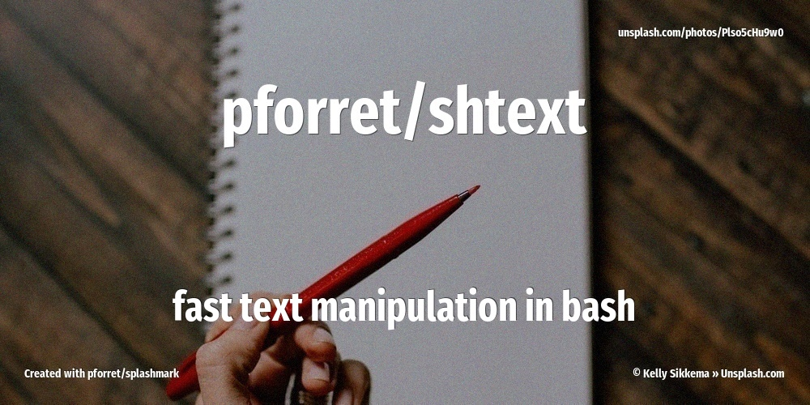

[](https://github.com/pforret/shtext/actions/workflows/shellcheck.yml)
[](https://github.com/pforret/shtext/actions/workflows/bash_unit.yml)


[](https://basher.gitparade.com/package/)

# shtext



Fast text manipulation in bash

## 🔥 Usage

```bash
Program: shtext 0.2.0 by peter@forret.com
Updated: Apr  3 21:48:10 2022
Description: perform fast text/string operations in bash
Usage: shtext [-h] [-q] [-v] [-f] [-l <log_dir>] [-t <tmp_dir>] <action>
Flags, options and parameters:
    -h|--help        : [flag] show usage [default: off]
    -q|--quiet       : [flag] no output [default: off]
    -v|--verbose     : [flag] output more [default: off]
    -f|--force       : [flag] do not ask for confirmation (always yes) [default: off]
    -l|--log_dir <?> : [option] folder for log files   [default: /Users/pforret/log/shtext]
    -t|--tmp_dir <?> : [option] folder for temp files  [default: /tmp/shtext]
    <action>         : [choice] text action to perform  [options: alphanum,ascii,lower,slugify,trim,upper,env,check,update]
                                                                                                             
### TIPS & EXAMPLES
* use shtext alphanum to remove non-alphanumeric chars and spaces
* use shtext ascii to convert all accents/diacritics to ASCII alternative
* use shtext lower to convert to lowercase
* use shtext slugify to create a slug that can be used in a URL
* use shtext trim to trim leading and trailing spaces
* use shtext upper to convert to uppercase
* --- the following are default bashew actions
* use shtext check to check if this script is ready to execute and what values the options/flags are
  shtext check
* use shtext env to generate an example .env file
  shtext env > .env
* use shtext update to update to the latest version
  shtext check
* >>> bash script created with pforret/bashew
```

## ⚡️ Examples

```bash
< $largefile.txt shtext lower
<<< "Some Éxtra Text" shtext upper
```

## 🚀 Installation

with [basher](https://github.com/basherpm/basher)

	$ basher install pforret/shtext

or with `git`

	$ git clone https://github.com/pforret/shtext.git
	$ cd shtext

## 📝 Acknowledgements

* script created with [bashew](https://github.com/pforret/bashew)

&copy; 2022 Peter Forret
